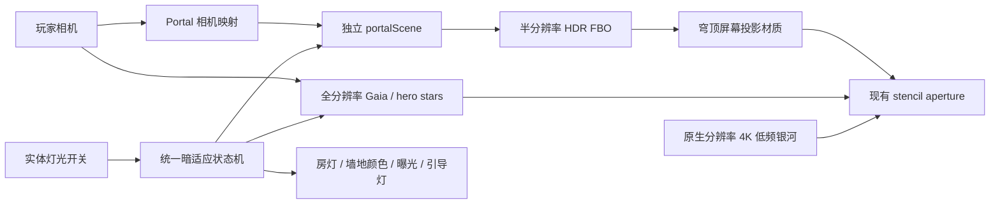

# 三楼 Impossible Observatory 实施计划

状态：**核心实现完成，可进入人工视觉与目标硬件 GPU 验收**
日期：2026-08-02  
适用范围：`/villa-map/` 蘑菇房三楼观测室

自动化证据（2026-08-02）：`npm test` **148/148 通过**；05:53 的 `npm run build` **通过**。这证明模块契约、数据、降级、资源清理与生产打包均已闭环，但不替代最终的人眼舒适度、wow factor 和目标硬件 GPU 帧时间验收。

## 1. 项目目标

把三楼穹顶从“贴在屋顶上的动态星空图”升级为一个真正的异空间窗口：房间仍属于 Villa Map，但穹顶里由独立的宇宙坐标系和渲染管线生成远星、近层星云与受控视差。

最终体验必须同时满足：

- 开灯时，墙壁、地板和摆设恢复与一、二楼一致的暖色，穹顶完全关闭，看不到星空残影。
- 关灯后，房灯先熄灭，短暂接近全黑；亮星、银河、暗星依次出现，而不是所有内容一起淡入。
- 玩家横向移动或探头时，近层星云产生轻微视差，远星保持在无限远，形成明显但不晕眩的距离感。
- 星空细节不再受一张 4096×1024 图片放大限制：照片只承担低频银河背景，清晰恒星由 GPU/真实星表生成。
- 三楼之外不得增加持续渲染成本，也不能破坏现有碰撞、家具、灯光、开关或 HUD。
- 任何设备无法运行高级效果时，仍能逐级回退到当前已可用的 stencil 动态星空。

## 2. 非目标

第一版不追求以下内容：

- 不为了技术标签迁移整张地图到 WebGPU。
- 不在浏览器中下载或解析完整 Gaia 数据库。
- 不把头部追踪、WebXR、黑洞引力透镜作为核心版本发布条件。
- 不删除当前 4K 星空图片、360 颗程序星或物理穹顶 fallback。
- 不使用全局 Bloom 把墙壁和摆设一起提亮。

## 3. 起点基线与当前 checkpoint

计划基于 `6602d26`（动态观测室星空与实体开关）以及当前工作区中的后续修复：

- 真实穹顶几何已可作为精确 stencil aperture。
- Canvas 已申请 stencil buffer。
- 星空使用 80 m 相机居中半球、4K 低频银河背景和 360 颗 GPU 星点。
- 星点具备独立闪烁、屏幕空间尺寸、像素比限制和 reduced-motion 支持。
- 开关状态已经分别驱动房灯、红色引导灯、墙地材质、标记亮度、曝光和星空 reveal。
- 开灯恢复暖奶油墙和木地板；关灯曝光约为 `0.17`，只保留很弱的安全轮廓。
- 纹理加载失败、React StrictMode 生命周期和 GPU 资源释放已经有 fallback/清理路径。
- 起点 Node 测试共 95 项，全部通过。

该起点已固化为可回退 checkpoint。当前核心实现增至 148 项 Node 测试，仍全部通过；05:53 生产构建通过。固定机位实施前截图保存在 `docs/observatory-baseline/`，六张实施后截图保存在 `docs/observatory-final/`。

## 4. 核心架构决定

### 4.1 首版继续使用 WebGLRenderer

首个生产版本保留当前 Three.js/WebGL/R3F 渲染器。现有依赖已经足够完成 Portal、FBO、Ray Marching、GPU Points 和 stencil，不新增运行时包。

WebGPU/TSL 只在真实性能数据证明 WebGL 无法达到目标，或后续确实需要 compute shader 时再立项。这样可以避免一次性迁移现有 `ShaderMaterial`、stencil 和整个 R3F 场景。

### 4.2 使用混合 Portal，而不是把所有内容烘进一张纹理

已实现的生产路径：

1. 独立 `portalScene` 只负责最昂贵、也最能接受半分辨率的体积星云。
2. 由虚拟相机先把星云渲染到半分辨率 HDR FBO；该 FBO 不申请自己的 depth/stencil buffer。
3. 主场景真实穹顶通过屏幕空间投影合成星云 FBO，并继续由现有穹顶/stencil 精确裁切。
4. 当前 4K 低频银河、Gaia 远星与少量 hero stars 都直接以 Canvas 原生分辨率绘制，避免再次经过低分辨率 FBO 后变糊。
5. 墙壁、家具和透明物仍由主场景正常深度与排序系统处理。

不采用“手动多次渲染整个主场景，再把宇宙直接盖上去”的方案，因为它更容易破坏 R3F 的透明物排序、深度关系和现有主渲染循环。

### 4.3 分离远近层的相机运动

- Gaia 与背景星：只复制主相机旋转/FOV，位置固定在宇宙原点，因此没有房间尺度的平移视差。
- 体积星云：只接收经过缩放和硬限制的玩家位移；初始视觉目标是横移 2 m 时产生约 0.5°–2° 的屏幕空间位移。
- 远星：同样横移时屏幕空间位移应小于 0.05°，肉眼上保持在无限远。
- 旋转、FOV、aspect 和 resize 必须同步，避免 Portal 像贴在穹顶上的监视器。
- 视差增益最终以人工舒适度验收为准，不把数学上“更强”当作视觉上“更好”。

### 4.4 统一暗适应状态

Node-pure 暗适应状态函数已经落地，并统一输出：

- `houseLight` / `roomDarkness`：房灯、曝光、暖色表面和安全轮廓的明暗程度。
- `portalReveal` / `brightStarReveal`：异空间入口与 hero stars 的首轮显现。
- `scotopicAdaptation` / `faintStarReveal` / `nebulaReveal`：暗星、星云细节和暗视觉发展的第二阶段。
- `celestialMotionScale`：reduced-motion 只冻结天体漂移，不破坏切灯明暗叙事。

建议时间节奏：

- 0–0.8 秒：房灯与暖色快速落下。
- 0.4–1.8 秒：Portal 和亮星显现，制造第一次 wow moment。
- 1.5–10 秒：银河细节与更暗恒星逐渐出现，模拟眼睛适应黑暗。
- 重新开灯：0.3–0.6 秒内先隐藏星空，再恢复正常房间颜色与曝光。
- 离开三楼或 teleport：立即复位，避免下一次进入时状态错乱。

## 5. 实际模块边界

实现保持纯逻辑/Three 工厂与 React 生命周期分离，实际文件如下：

| 模块 | 职责 |
|---|---|
| `src/villa-map/observatory-adaptation.js` | 暗适应状态、曲线和纯数学测试 |
| `src/villa-map/observatory-portal.js` | Portal 尺寸/相机映射、无 depth/stencil FBO、stencil 合成与幂等释放 |
| `src/villa-map/mushroom-nebula.js` | Node-safe 体积星云 ray-march ShaderMaterial、质量步数与更新/释放 |
| `src/villa-map/gaia-stars.js` | 紧凑星表解码、星等/颜色映射和 BufferGeometry 工厂 |
| `src/villa-map/observatory-quality.js` | High/Medium/Low/Minimum 能力上限、p95 迟滞调档与 fallback 策略 |
| `src/villa-map/observatory-diagnostics.js` | 固定相机书签、帧统计与 FBO 显存估算 |
| `src/villa-map/react/MushroomObservatoryRuntime.jsx` | 统一暗适应导演、4K/Gaia 懒加载、FBO 预热/逐帧渲染、降级与资源生命周期 |
| `src/villa-map/react/ObservatoryDiagnostics.jsx` | query-only 固定机位、手动时间推进、runtime provider 与性能快照 |
| `scripts/build-gaia-star-catalog.mjs` | 离线裁剪并生成静态二进制星表，不在运行时访问网络 |
| `public/data/gaia-bright-stars-v1.bin` | v1 紧凑运行时星表，80,000 条、1,920,032 bytes |
| `public/data/gaia-bright-stars-v1.meta.json` | Gaia DR3 查询、checksum、LOD、来源、credit 与 acknowledgement |

Gaia v1 来自 ESA Gaia DR3 `gaiadr3.gaia_source` 的可复现 ADQL 查询，运行时不访问 ESA；署名为 **ESA/Gaia/DPAC**，完整 acknowledgement 与官方 credit URL 固化在 metadata 中。80,000 条按 G magnitude、`source_id` 排序，Low/Medium/High 前缀分别为 8,000/35,000/80,000 条。运行时 shader 通过 `uMagnitudeLimit` 与每颗星的 Gaia G magnitude 比较，按真实星等从亮到暗逐层显现，而不是把整层 Gaia 一起调透明度。

## 6. 分阶段实施

每一阶段都必须通过四道门，才进入下一阶段：

1. `npm test`
2. `npm run build`
3. 固定机位人工视觉验收
4. 真实 GPU 性能验收

每一阶段保持独立可回退；是否创建 Git 提交由用户在阶段验收后确认。

当前 Phase 0–5 的**核心代码与自动化证据均已完成**。下文的“待人工验收”表示仍需按第 7、8 节确认人眼画面、舒适度和目标硬件性能；固定 20 秒路线视频与目标设备三轮 GPU p95 是验收证据，不是代码缺口。

### Phase 0：固化基线与建立测量方式（核心完成，待人工验收）

实际完成与证据：

- `observatory-diagnostics.js` 固化 `l2-stair`、`loft-center`、`loft-edge`、`loft-room` 四个相机书签、p50/p95/p99/1% low 统计和显存估算。
- `?observatory=test` 使用 `frameloop="never"`，可确定性推进 0.5/2/10 秒；`?observatory=perf` 保留真实帧循环，并同时挂载正常 `PlayerControls`，可以实际走完验收路线。
- 六张固定状态实施前截图保存在 `docs/observatory-baseline/`；六张实施后截图保存在 `docs/observatory-final/`，覆盖 L2、开灯、关灯 0.5/2/10 秒与穹顶边缘。
- 4K WebP 仍为原始 4096×1024；148/148 自动测试与 05:53 生产构建通过。20 秒人工路线视频和目标设备三轮 GPU p95 仍属人工验收证据，不是代码缺口。

工作内容：

- 保存五个固定状态：L2 楼梯、L3 开灯、刚关灯、完全显现、穹顶边缘。
- 为这些状态保存截图和一段固定 20 秒人工路线视频。
- 在开发模式记录 `renderer.info`、CPU 帧时间、质量档、FBO 尺寸和估算显存。
- 固定相机、seed 和时间，确保后续视觉比较可重复。
- 确认当前 4K WebP 的原文件和尺寸不被后续阶段改写。

验收门槛：

- 148 项当前测试继续全部通过，生产构建通过。
- 开灯颜色、关灯暗度、开关节奏、星点闪烁和 stencil 边缘均获得人工确认。
- 同一设备三轮基线测试的 p95 波动不超过 10%；否则先修正测量方式。

### Phase 1：Portal 骨架，视觉保持不变（核心完成，待人工验收）

实际完成与证据：

- `observatory-portal.js` 已实现受控视差相机、全屏三角形合成、stencil ref 7、无 depth/stencil/mipmap 的 FBO 和幂等释放；最大尺寸硬限制为 1280×720。
- `MushroomObservatoryRuntime.jsx` 在 `useFrame(..., -1)` 只预渲染 `portalScene`，玩家控制保持 `-2`，主场景仍由 R3F 自动渲染。
- resize、DPR、质量档变化、L3 gating、开灯一次性预热、HalfFloat→RGBA8 fallback、第二次 FBO 失败回 Low、AbortController 与 StrictMode cleanup 均有源码契约和 Node 测试。
- 4K 背景、360 hero stars 与 Gaia 留在主场景原生分辨率；FBO **只含体积星云**。
- shader failure 已按 Portal、Gaia、native sky 分类：Portal 失败回退 Low，Gaia 失败保留 4K/hero stars，native sky 失败 fail-close 到物理 dome；context loss 时隐藏 live layers，restore 后重建并重新预热。
- 真实浏览器已通过 context loss/restore；resize 到 1024×768 时得到 977×658 drawing buffer 与 537×362 Medium FBO，未发生拉伸或尺寸失配。

工作内容：

- 建立独立 `portalScene`、虚拟相机和受尺寸上限约束的 FBO。
- 建立主相机到 Portal 相机的纯数学映射。
- 先用透明/零强度诊断层验证离屏渲染与合成，保持当前银河和星点的原生分辨率画面不变。
- 玩家控制继续在 `useFrame(..., -2)` 更新；Portal 预渲染放在 `useFrame(..., -1)`，之后仍由 R3F 自动完成主场景渲染。
- 混合路径已经接入默认运行时；`mushroom-sky.js` 的 4K 背景/hero stars 仍是原生主场景层和高级效果失败时的稳定 fallback。
- 完成 resize、DPR、L3 gating、lights-on pause、加载失败和重复 dispose。

自动测试重点：

- 远层相机零平移视差，近层相机只有受控视差。
- FBO 尺寸有上限并正确响应 resize/DPR。
- 三楼以外或资源未就绪时不执行 Portal pass；L3 开灯时只允许一次显式预热，之后暂停，关灯 reveal 后才持续渲染。
- stencil 外像素不被 Portal 改写。
- FBO、材质与纹理可以重复安全释放。
- 浮点纹理、stencil 或 WebGL2 能力不足时进入稳定 fallback。

视觉验收：

- 从穹顶中心、边缘、楼梯口和贴墙位置检查，星空不漏到墙、地板或楼下。
- 快速转头、窗口缩放和浏览器缩放无闪屏。
- 开灯时穹顶完全关闭，不残留上一帧宇宙。

阶段预算与停损：

- 无体积星云时新增 GPU 时间不超过 2 ms，CPU 不超过 0.5 ms。
- 新增 draw calls 不超过 4，FBO 最大 1280×720，增量显存不超过 16 MB。
- 若标准档总帧耗增加超过 20%，或两轮仍无法消除边缘泄漏/闪烁，则保留当前直接 stencil 星空并暂停二次场景方案。

### Phase 2：Gaia 真实恒星层（核心完成，待人工验收）

实际完成与证据：

- 已生成 `gaia-bright-stars-v1.bin`（80,000 条，1,920,032 bytes，24 bytes/record）及可复现 metadata/checksum。
- 字段包含 Gaia DR3 `source_id`、ICRS 单位向量、G magnitude 与 BP-RP；正式 credit 为 ESA/Gaia/DPAC。
- High/Medium/Low 使用 80,000/35,000/8,000 条前缀；单个 `THREE.Points` draw call 在主场景经同一 stencil 裁切，随相机居中而无房间尺度平移视差。
- shader 使用 `uMagnitudeLimit` 对每颗星的 G magnitude 做阈值与 feather 比较；`faintStarReveal` 逐步提高极限星等，真实实现亮星先出现、暗星后出现。
- 目录懒加载失败或 Minimum 档时保留原有 360 颗程序星；加载使用 AbortController，解码、LOD、坐标、checksum、大小和幂等释放均有测试。

工作内容：

- 从 ESA Gaia 公开数据离线裁剪视觉所需字段，不在用户浏览器访问 ESA。
- 将 RA/Dec 离线转换为 y-up 单位方向；保留 Gaia ID、G magnitude、BP-RP 或预烘 RGB。
- 生成紧凑二进制文件和 metadata/acknowledgement。
- 以单个 GPU Points draw call 绘制远星；星等驱动尺寸和亮度，颜色来自恒星色温。
- 当前 360 颗程序星继续承担少量 hero twinkle 和加载失败 fallback。
- 暗适应通过逐渐提高可见星等上限，让亮星先出现、暗星后出现。

建议质量档：

| 档位 | 目标星数 | 用途 |
|---|---:|---|
| High | 约 80,000 | 较强桌面 GPU |
| Medium | 约 35,000 | 标准桌面/集显 |
| Low | 约 8,000 | 低端设备 |
| Minimum | 当前 360 | 数据或能力失败时 |

自动测试重点：

- 数据生成确定、带版本/来源；ID 唯一，数值有限并在合法范围。
- 已知 RA/Dec 样本转换正确，单位向量长度正确。
- 星等排序、LOD 选择、记录数、文件大小和 GPU buffer 都有硬上限。
- 加载/解码失败时回到当前程序星。

阶段预算与停损：

- 压缩运行资源尽量不超过 2 MB，GPU buffer 不超过 5 MB。
- 解码主线程单次阻塞不超过 50 ms；超过则使用 Worker 或分帧上传。
- 单 draw call，星层 GPU 增量不超过 0.8 ms。
- 若真实分布视觉上成为均匀“电视雪花”，则缩减为真实亮星骨架，其余由美术化程序星补足。

### Phase 3：体积星云 Ray Marching（核心完成，待人工验收）

实际完成与证据：

- `mushroom-nebula.js` 已实现最大 48 steps 的 Node-safe ray-march shader：High 48 steps、Medium 30 steps；Low/Minimum 在生产路径中不分配体积 FBO。
- Portal 分辨率为 High 0.68（最大 1280×720）、Medium 0.55（最大 960×540）；受控视差系数分别为 0.22/0.16。
- reduced-motion 冻结天体漂移但保留 reveal；只在 L3 需要时渲染，并在开灯状态预热一次，避免首次关灯才编译。
- **合理偏差：未加入 temporal accumulation。** 当前无 history 版本避免拖尾/鬼影和额外显存；Low 直接关闭体积 FBO，而不是维持低清 2D Portal。

工作内容：

- 在 `portalScene` 内加入低分辨率体积星云 pass。
- 使用 3D FBM/domain warp、early-exit 和 dither 形成有厚度的发光尘埃。
- 星云只接收少量相机平移；远星完全不接收，制造层间视差。
- reduced-motion 冻结漂移，但不取消关灯后的平滑 reveal。
- 当前交付无 temporal history；只有人工验收确认噪点仍明显且性能有余量时，才另立 temporal accumulation 实验。

建议质量档：

- High：FBO 0.65–0.7 分辨率，40–48 steps。
- Medium：FBO 0.5–0.6 分辨率，28–32 steps。
- Low：关闭 Ray Marching 和体积 FBO，保留原生 4K 银河、8k Gaia 与 hero stars。

自动测试重点：

- 各档采样步数、FBO 比例和最大尺寸有硬上限。
- 浏览器中真实编译 shader，控制台无 GLSL error。
- 固定 seed/time 的区域亮度和轮廓保持在容差内，不要求跨 GPU 逐像素相等。
- 不产生 NaN、整屏黑、历史纹理泄漏或质量档来回抖动。

视觉验收：

- 横向移动可看到星云内部层次，但不能像近处烟雾扑脸。
- 快速转头无明显拖尾、鬼影、色带、极点漩涡或噪点游泳。
- 星云不粘在镜头上，穹顶边缘仍保持干净。

阶段预算与停损：

- 标准档星云 pass GPU 不超过 4 ms，Medium 不超过 3 ms。
- 增量显存 High 不超过 32 MB，Medium 不超过 16 MB。
- 若标准档连续超过 5 ms，或两轮优化仍有明显 temporal 鬼影，则交付 2D/多层视差星云，把真正体积版留在实验模式。

### Phase 4：暗适应叙事与局部发光（核心完成，待人工验收）

实际完成与证据：

- `observatory-adaptation.js` 成为唯一暗适应导演：`houseLight`、`roomDarkness`、`portalReveal`、`brightStarReveal`、`scotopicAdaptation`、`nebulaReveal`、`faintStarReveal` 与 `celestialMotionScale` 由同一状态生成。
- 灯光/墙地材质/HUD marker/曝光、4K 背景、hero stars、Gaia 和星云均消费同一 `adaptationRef`；关灯顺序与 10 秒暗适应、反复切灯连续性、离开 L3 复位均有测试。
- 开灯并完成一次性预热后，主星空、Gaia 与 Portal 均停止，诊断记录为零持续 cosmos draw；连续切灯 20 次后 `renderer.info.memory.textures` 与 `.geometries` 均不增长。
- reduced-motion 的两次定时截图 hash 完全相同，full-motion 对照 hash 不同，证明冻结确实生效且正常动态路径仍在运行。
- **合理偏差：未加入 Bloom。** 当前 hero-star SDF flare 与加法星云合成已提供局部高光，避免墙壁洗灰、额外 pass 和显存；只有人工验收明确缺少高光时再考虑 Portal 内 selective bloom。

工作内容：

- 用统一状态机替代各组件各自读取 boolean 的时间逻辑。
- 让亮星、银河主体、暗星和星云细节按不同阈值出现。
- 保留开灯暖色、关灯影院暗场、红色引导灯和实体开关 LED。
- 首版优先使用现有 SDF halo/flare；只有仍然缺少光晕时，才加入 Portal 内部的低分辨率 selective bloom。
- Bloom 不进入主场景墙壁、家具、HUD 或开关 LED。

自动测试重点：

- 暗适应曲线是 Node-pure 函数，时间顺序、上下限、快速反复切灯和复位可测试。
- 开灯、离开三楼和 teleport 后状态正确复位。
- 曝光与 reveal 不出现负数、NaN、单帧白闪或星空残帧。
- reduced-motion 保留平滑明暗切换，但冻结不必要的漂移和闪烁。

视觉验收：

- 顺序明确为“灯先灭 → 短暂近黑 → 亮星 → 银河/暗星”。
- 暗场能辨认楼梯边缘、开关和少量摆设轮廓，但看不清正常颜色。
- 只有少量亮星和星云核心发光，墙壁不能被 Bloom 洗灰。
- 连续快速按 E 不闪烁、不跳状态、不累积曝光误差。

阶段预算与停损：

- 若启用 Bloom，使用四分之一分辨率，GPU 增量不超过 1.5 ms、显存不超过 12 MB；Low 档关闭。
- 超预算时按“移除 Bloom → 降低星云 → 减少星数”的顺序降级，不牺牲开关叙事、开灯原色和关灯安全轮廓。

### Phase 5：质量分级、预热与发布稳定性（核心完成，待人工验收）

实际完成与证据：

- `observatory-quality.js` 实现 High/Medium/Low/Minimum 四档能力上限、2 秒超预算降档、8 秒持续余量升档和 3 秒 cooldown，离开 L3/开灯后清空旧性能证据。
- Gaia fetch 与 Portal/FBO allocation 都推迟到玩家到达 L2 观测室接近区；4K texture 解码后用 `requestIdleCallback`（或 timeout fallback）预上传。native sky/Gaia/composite 先在 default framebuffer 语义下调用 `gl.compile`，确保 Three 缓存真实主画布颜色空间的 Shader variant，再通过 1×1 render target 上传 geometry/uniform state。页面不可见时不以异常 delta 污染质量判断。
- query-only QA 可强制机位、灯态、时间、质量和 motion；`observatory=perf` 同时挂载正常 `PlayerControls`，可走固定 20 秒路线；普通访问忽略 `quality`/`motion` override，并始终开灯进入。
- runtime diagnostics provider 报告当前质量、p95、暗适应通道、FBO 类型/尺寸/帧数、Gaia LOD/数量、4K 纹理状态、shader/fallback 错误和 context loss/restore 计数。
- 分类 shader fallback、context loss/restore、resize、连续切灯与资源稳定性已在浏览器通过；148/148 tests 与 05:53 production build 已通过。剩余是人工画面判断、20 秒路线视频及目标设备三轮 GPU p95 证据。

工作内容：

- 建立 High / Medium / Low / Minimum 四档能力与性能回退。
- 到达 L2 观测室接近区后懒加载本地 Gaia 并分配 Portal；idle 上传 4K texture，先按主画布输出颜色空间编译 native sky/Gaia/composite，再以 1×1 native target 预上传其渲染状态，避免第一次关灯才编译或上传。
- 为自动降档增加迟滞，避免画质在两个档位之间每帧跳动。
- 补充 query-only 浏览器诊断层，用固定机位、手动时间和 runtime provider 捕获 GLSL/FBO 错误与 stencil 视觉泄漏。
- 完成连续切灯、resize、离开/重进、分类 shader/framebuffer fallback、context loss/restore 与资源清理，并已完成浏览器功能验证。

回退阶梯：

1. High：0.68 Portal + 80k Gaia + 48-step 体积星云，无 temporal/Bloom。
2. Medium：0.55 Portal + 35k Gaia + 30-step 体积星云，无 temporal/Bloom。
3. Low：8k Gaia + 4K 银河 + hero stars，**不分配体积 FBO**。
4. Minimum：4K 银河 + 当前 360 hero stars，**不加载 Gaia、不分配体积 FBO**。
5. Failure：物理 fallback dome。

建议自动调档：连续 2 秒 p95 超过目标时降一级；连续 8 秒明显低于目标才允许升一级。

发布门槛：

- 任何设备即使只能进入 Minimum，也必须保留正确开关剧情、亮灯原色、暗场轮廓、无穿帮遮罩和完整资源清理。
- 离开三楼或开灯后，宇宙渲染 pass 的 CPU/GPU 增量接近零。
- 首次关灯无超过 100 ms 的可感知 shader 编译卡顿。
- 全部测试、生产构建和固定机位验收通过。

### Phase 6：可选 Observatory Lab（未实施，不阻塞核心验收）

以下内容均未进入本次实现，不阻塞核心版本；未来若实施，必须分别通过实验开关启用：

#### 头部追踪 / Fish-tank VR

- 玩家主动授权摄像头后，用头部位置驱动 off-axis projection。
- 视频只在本地处理，不上传、不保存；关闭模式或组件卸载时停止所有 MediaStream tracks。
- 头部丢失、多人画面、页面隐藏或授权失败时安全回中。
- 目标端到端延迟低于 80 ms，平均处理不超过 5 ms/frame；达不到则只保留隐藏实验入口。
- reduced-motion 默认不启用头部追踪。

#### WebXR

- 只在真实兼容设备上验收 6DoF Portal，不以桌面模拟器代替。
- 桌面体验永远是完整主路径，不能要求 VR 才能看到核心内容。

#### WebGPU / TSL

只有满足以下任一条件才开展迁移 spike：

- WebGL 体积 pass 在目标硬件经过两轮优化仍无法达到预算。
- 新功能确实需要 GPU compute，而不是只为了展示 WebGPU 标签。
- 现有自定义 shader、stencil、后期处理和 R3F 生命周期都已有明确的 TSL 替代方案。

#### 稀有天文事件

流星、极光或引力透镜可以作为低概率事件，但不能持续抢走宁静观测室的主题。事件必须可由 reduced-motion 关闭，并且不改变核心性能预算。

## 7. 性能与测量协议

暂定参考设备：

- 标准档：Intel Iris Xe / Apple M1 级集显，1920×1080，目标 60 FPS。
- 低端档：Intel UHD 620 或相近设备，1280×720，最低稳定 30 FPS。
- 高端独显只验证效果上限，不作为优化基准。

每次性能验收执行固定 20 秒路线：L2 上楼 → L3 开灯 → 关灯 → 等待完全显现 → 横向移动 → 快速环视 → 重新开灯。

- 预热 5 秒，连续测量 3 次。
- 记录 CPU/GPU frame time 的 p50、p95、1% low，以及 draw calls、triangles、points、textures、FBO 尺寸和估算显存。
- 标准档完整星空模式目标 p95 ≤ 16.7 ms；低端档 p95 ≤ 33.3 ms。
- 偶发峰值不得连续超过 50 ms。
- 开灯或离开 L3 后，新渲染器 CPU/GPU 增量目标 ≤ 0.2 ms。
- Headless/自动化浏览器只做功能、画面、资源趋势与诊断帧间隔检查；它的 FPS/p95 不作为目标硬件 GPU 性能结论。

2026-08-02 已完成的浏览器诊断 checkpoint：

- Medium 稳态诊断 p95 约 13–16 ms；High 正确启用 80k Gaia，FBO 为 1280×662。这里只证明真实帧循环、LOD/FBO 接线与诊断采样正常，**不能**据此宣称 Iris Xe/M1 或 UHD 620 已达标。
- 浏览器 resize 到 1024×768 后，drawing buffer 为 977×658，Medium FBO 为 537×362；尺寸随 DPR/viewport 正确更新。
- WebGL context loss/restore 已恢复成功；连续切灯 20 次后 textures/geometries 不增长；开灯稳态为零持续 cosmos draw。
- reduced-motion 两次截图 hash 完全相同，full-motion 对照 hash 不同。

仍需人工提供的性能验收证据是：固定 20 秒路线视频，以及在目标 Iris Xe/M1 和 UHD 620 级设备上各预热 5 秒、连续三轮记录 GPU/CPU p95。它们不属于代码缺口。

## 8. 固定视觉验收矩阵

每阶段至少检查以下机位和动作：

| 场景 | 主要检查点 |
|---|---|
| L2 楼梯仰视 | 星空不得提前穿过楼板或墙壁 |
| L3 楼梯到达、开灯 | 暖色与一二楼一致，穹顶完全关闭 |
| 关灯后 0.5 秒 | 房灯先退场，无白闪或星空残帧 |
| 关灯后 2 秒 | Portal 和亮星形成第一层 wow moment |
| 关灯后 8–10 秒 | 暗星与星云细节完整，房间仍足够暗 |
| 房间中心直视穹顶 | 无图片贴脸感、极点接缝或近距离像素感 |
| 沿房间横移约 2 m | 远星固定，近星云只有轻微视差 |
| 贴墙看穹顶边缘 | 无 stencil 泄漏、木圈穿帮或透明排序错误 |
| 快速环视/resize | 无 temporal 鬼影、闪屏或 FBO 拉伸 |
| 连续切灯 20 次 | 状态、显存、纹理和材质数量不持续增长 |
| reduced-motion | 漂移/闪烁冻结，切灯和可读性仍完整 |

实施后六张固定截图已收集在 `docs/observatory-final/`。自动浏览器已经确认 resize 尺寸、20 次切灯资源稳定、context loss/restore 和 reduced-motion hash；这些是功能证据。星空距离感、两层视差舒适度、stencil 边缘、影院暗度、第一次关灯的 wow factor 仍必须由人眼在实际显示器上验收。

## 9. 主要风险与缓解

| 风险 | 缓解方式 |
|---|---|
| Ray Marching 导致移动端热降频 | 半/四分之一分辨率、步数分档、early-exit、Low 档关闭 |
| Portal 仍像贴图 | 虚拟相机匹配 FOV，远近层分离，近层只用克制视差 |
| 星星经过 FBO 变糊 | Gaia/hero stars 直接全分辨率绘制，FBO 只承载低频体积内容 |
| Temporal 鬼影 | 先交付无 history 版本；切灯、resize、teleport 和快速相机变化时重置 |
| Bloom 洗亮房间 | Bloom 只在 Portal 内部，优先使用星点自身 halo |
| 颜色空间重复转换 | 明确 FBO color space、`toneMapped` 和最终输出职责，并做浏览器截图验收 |
| React StrictMode 重复释放 | 生命周期 token、幂等 dispose、连续挂载/卸载测试 |
| Gaia 数据体积或主线程卡顿 | 离线裁剪、紧凑二进制、LOD、必要时 Worker/分帧上传 |
| 高级路径失败变成黑顶 | 分类处理 shader failure：Portal→Low/native sky，Gaia→4K+hero stars，native sky→物理 dome；context restore 后重建与预热 |
| 摄像头隐私/兼容性 | 头部追踪仅主动开启、本地处理、清晰关闭，不进入核心路径 |

## 10. 总体验完成标准

核心工程实现已完成；最终体验只有同时满足以下人工与性能条件才算验收完成：

- 玩家第一次关灯时，能清楚感受到屋顶“消失为宇宙”，而不是一张图片变亮。
- 横向移动能读出至少两个深度层，但不会出现近处烟雾或明显晕动。
- 清晰恒星不受 4K 背景图分辨率限制，原始 4096×1024 资源仍保持不变并作为 fallback。
- 开灯时三楼恢复正常暖色，外部星空完全不可见；关灯时黑暗但保留安全轮廓。
- 三楼之外没有可测量的持续性能退化。
- 标准档与低端档达到各自预算，所有降级路径都保持剧情和遮罩正确。
- 148/148 Node 测试、05:53 production build、浏览器 context/fallback/resize/资源检查均已通过，六张实施后固定机位截图已收集。
- 最终效果经过用户人工验收。

## 11. 下一步

进入人工验收，不再追加核心功能。建议从以下诊断 URL 开始：

- 确定性视觉：`/villa-map/?observatory=test&view=loft-center&lights=off&quality=medium&motion=full`
- 真实帧循环诊断：`/villa-map/?observatory=perf&view=loft-center&lights=off&quality=medium`（同时挂载 `PlayerControls`，可直接走路线；自动化 p95 不是目标 GPU 结论）
- `view` 可选 `l2-stair`、`loft-center`、`loft-edge`、`loft-room`；`quality` 可选 `high`、`medium`、`low`、`minimum`；`motion` 可选 `full`、`reduce`。`lights=off` 用于直接进入关灯状态。

按第 8 节矩阵人工检查开灯原色、0.5/2/10 秒 reveal、穹顶边缘、横移视差、快速环视和 wow factor，并录制固定 20 秒路线；再按第 7 节在目标 GPU 上各记录三轮 p95。resize、连续切灯、context loss/restore 和 reduced-motion 已有浏览器功能证据，但仍可随路线复核。若验收发现问题，优先调参数或降级策略，不在验收前引入 Bloom、temporal accumulation 或 Phase 6 技术。

## 12. 技术参考

- [Three.js WebGPU Renderer](https://threejs.org/manual/en/webgpurenderer)
- [Three.js TSL](https://threejs.org/docs/TSL.html)
- [Three.js Portal example](https://threejs.org/examples/webgpu_portal.html)
- [Three.js render targets](https://threejs.org/manual/en/rendertargets.html)
- [ESA Gaia Archive](https://gea.esac.esa.int/archive/)
- [Three.js WebXR basics](https://threejs.org/manual/en/webxr-basics.html)
