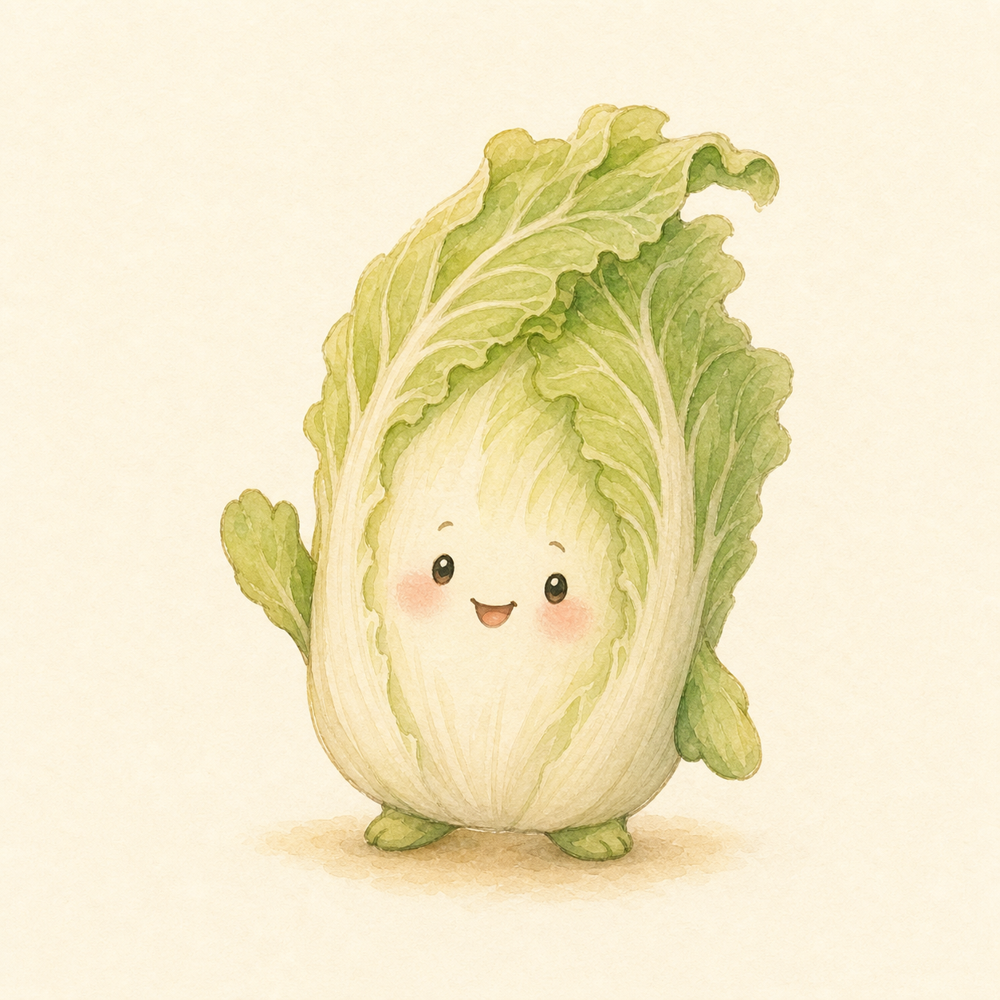

# 白白菜角色参考档案

状态：**已选定**

正式候选：**4 号「灵动小精灵型（挥手白菜）」**

选定日期：2026-08-14



## 正式参考文件

- 稳定引用路径：`/characters/baibaicai/baibaicai-reference.png`
- 机器可读档案：`public/characters/baibaicai/manifest.json`
- 原始规格：1254 × 1254、RGB PNG
- 生成方式：OpenAI 内置 `imagegen`
- 风格参考（只参考画风，不复制角色或构图）：`public/notes-art/2026-08-08.webp`、`public/notes-art/2026-08-07.webp`

## 角色身份

白白菜（也称白菜）是猪猪们的好朋友。他本体是一棵拟人化的 napa cabbage：浅色菜心占主体，芹菜绿与鼠尾草绿外叶分层包裹，顶部有自然偏向一侧的上扬叶尖。五官直接长在菜心上，以小圆黑眼、细眉、开口微笑和淡桃色脸颊为主要识别点。

正式基础图里的挥手只是参考姿势，不是永久动作。后续小记可以按情节自由改变表情、姿势、眼镜、衣服、帽子、 cosplay 和手持道具。

## 后续生图必须保持

1. 一眼看出是直立的 napa cabbage，不能画成圆生菜、青江菜、西兰花或普通绿色团子。
2. 五官直接长在浅色菜心上，不增加独立的人头，也不添加猪鼻子。
3. 保持紧凑体型、浅色大菜心、分层外叶和偏向一侧的灵动上扬叶冠。
4. 保持小圆黑眼和温和亲切的总体气质；具体表情可以随故事变化。
5. 保持猪猪小记的温暖儿童水彩绘本画风：奶油纸底、柔和铅笔线、细腻纸纹、低对比光线。
6. 装扮只能叠加在基础身份上，不能遮掉全部菜叶结构或永久改变角色物种与轮廓。

建议在未来生图时把正式图片标为：`Image 1: 白白菜的身份参考图，只锁定角色身份，不锁定姿势或装扮。`

## 五个候选

| 编号 | 方向 | 文件 | 结果 |
| --- | --- | --- | --- |
| 1 | 圆糯经典型 | `public/characters/baibaicai/candidates/baibaicai-candidate-01-round-classic.png` | 保留 |
| 2 | 高挑文静型 | `public/characters/baibaicai/candidates/baibaicai-candidate-02-tall-quiet.png` | 保留 |
| 3 | 胖软治愈型 | `public/characters/baibaicai/candidates/baibaicai-candidate-03-soft-healing.png` | 保留 |
| 4 | 灵动小精灵型（挥手白菜） | `public/characters/baibaicai/baibaicai-reference.png` | **正式选定** |
| 5 | 淡定冷幽默型 | `public/characters/baibaicai/candidates/baibaicai-candidate-05-deadpan-gentle.png` | 保留 |

## 生成提示档

候选使用下面的共同规格，并分别追加各自方向。1 号在共同规格基础上更强调圆糯梨形、整齐叶冠与拥抱感；2–5 号使用下列方向原文。

```text
Use case: illustration-story
Asset type: recurring character reference portrait for 猪猪小记
Input images: Image 1 and Image 2 are visual-style references only. Borrow their warm children's watercolor storybook medium, cream paper texture, soft pencil linework, gentle low-contrast light, and cozy palette. Do not copy any pig, prop, building, scene, or composition from them.
Primary request: Create a distinct base-design candidate for a new recurring character named 白白菜, an anthropomorphic napa cabbage and a good friend of the piglets.
Subject baseline: exactly one living napa cabbage character, no pigs and no other characters. The face is directly on the pale cabbage heart, with layered pale ivory ribs and natural light-green outer leaves, two simple leaf-arms and two tiny feet. Gender-neutral. Preserve a clear botanical napa-cabbage silhouette that will still read when later wearing glasses, clothing, hats, or cosplay costumes.
Style/medium: warm hand-painted children's watercolor picture-book illustration matching the references; delicate natural paper grain; soft edges with clean enough contour definition for future character-consistency reference.
Composition/framing: square canvas, full body fully visible, centered, relaxed three-quarter-front standing pose, generous empty margin on every side.
Scene/backdrop: plain warm cream watercolor paper background (#FFF8EF), minimal faint grounding wash only, no scenery.
Color palette: natural napa cabbage ivory, celery green, muted sage, tiny peach blush; harmonious with the piglet journal palette.
Constraints: exactly one cabbage character; no clothes, glasses, hat, costume, or handheld prop in this base design; no human; no pig; no extra face; no duplicated limbs; no text, Chinese characters, letters, numbers, logo, frame, character-sheet labels, or watermark.
Avoid: glossy 3D, vector icon, anime, photorealism, broccoli, round lettuce, bok choy, generic green blob, scary expression.
```

### 候选 1：圆糯经典型

```text
Short, round, pear-shaped chibi proportions; layered pale ivory cabbage heart wrapped by soft light-green outer leaves; a tidy mint-green leafy crown; two tiny warm-black bead eyes on the pale center; a very small open smiling mouth; faint peach blush; two simple leaf-arms and two tiny feet. Gentle, dependable, slightly quiet, and very huggable.
```

### 候选 2：高挑文静型

```text
Make the body noticeably taller and narrower than a round chibi mascot, with a softly tapered upright napa-cabbage form. Long outer leaves hug the sides like a calm protective wrap; the leafy crown is gently ruffled and slightly droops forward like soft bangs. Use small oval warm-black eyes, a tiny closed curved smile, subtle blush, and leaf-hands resting quietly near the belly. The emotional read is thoughtful, shy, patient, and kind. Do not make the character old or sad.
```

### 候选 3：胖软治愈型

```text
Make the lower body broad and cushiony with a squat dumpling-like silhouette, but keep unmistakable napa-cabbage vertical ribs and layered leaves. Two rounded outer leaves open slightly like soft sleeves, framing the pale heart. Use widely spaced tiny bead eyes, a tiny round "o"-shaped delighted mouth, gentle blush, and very small feet. The emotional read is warm, comforting, innocent, and a little clumsy. Keep the silhouette distinct from Candidate 1 by using a broader bottom, lower leafy crown, and open sleeve-like outer leaves.
```

### 候选 4：灵动小精灵型（正式选定）

```text
Use a compact medium-height cabbage body with a lively asymmetrical crown: several soft leaf tips sweep upward to one side like a natural leafy cowlick, while the pale napa heart stays large and clear. Give it bright small eyes with one tiny watercolor highlight, a cheerful side-curved smile, faint blush, one leaf-hand raised in a modest wave and the other relaxed. The emotional read is curious, playful, quick-witted, and friendly. Keep it gentle and botanical, not an anime creature.
```

### 候选 5：淡定冷幽默型

```text
Use a slightly elongated, realistic-napa silhouette with a neat layered crown and sturdy overlapping outer leaves, softened into the same cute storybook world. Give it two very small evenly spaced dot eyes, relaxed low brows, and a tiny almost-straight mouth with just the slightest upward corner; minimal blush. Leaf-arms rest loosely at the sides and the feet are planted. The emotional read is quiet, observant, deadpan-funny, dependable, and secretly tender—not angry, gloomy, or unfriendly.
```
